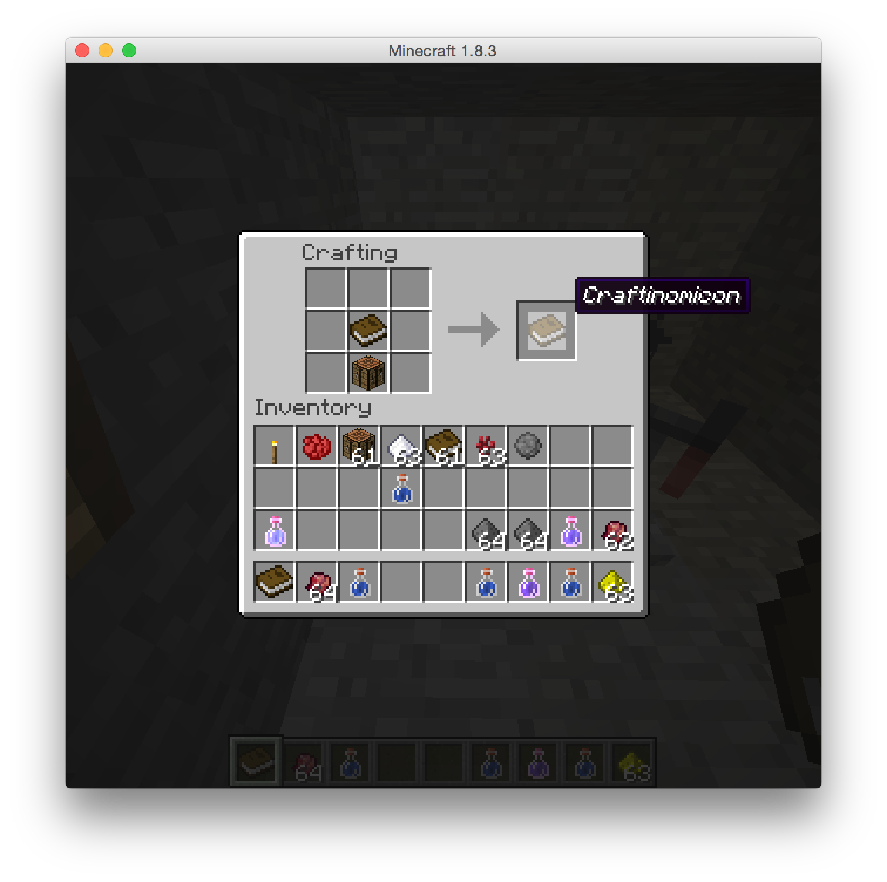
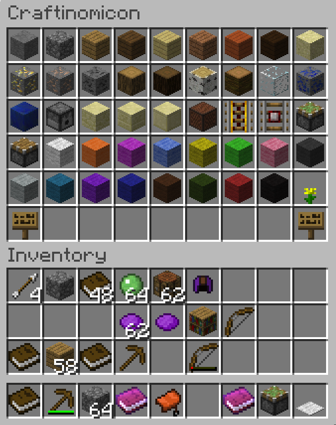
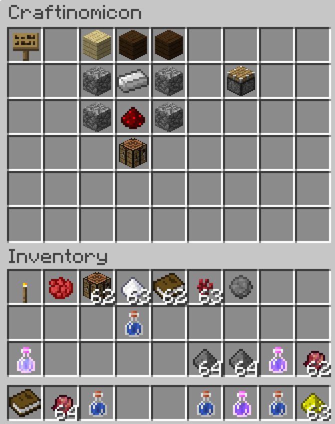
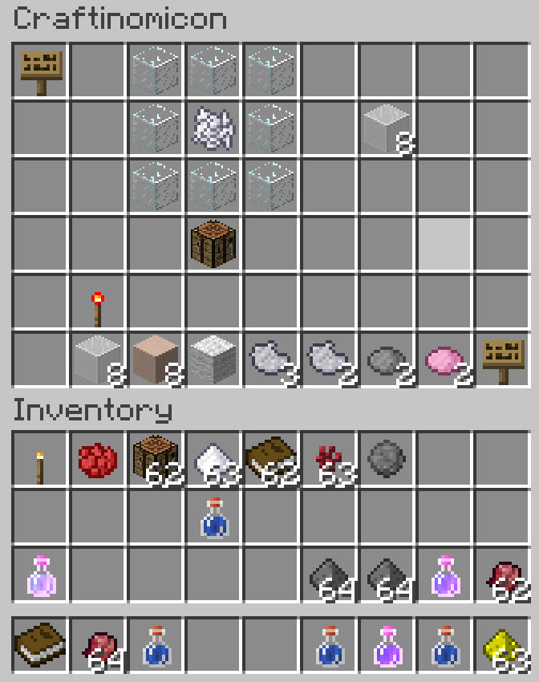
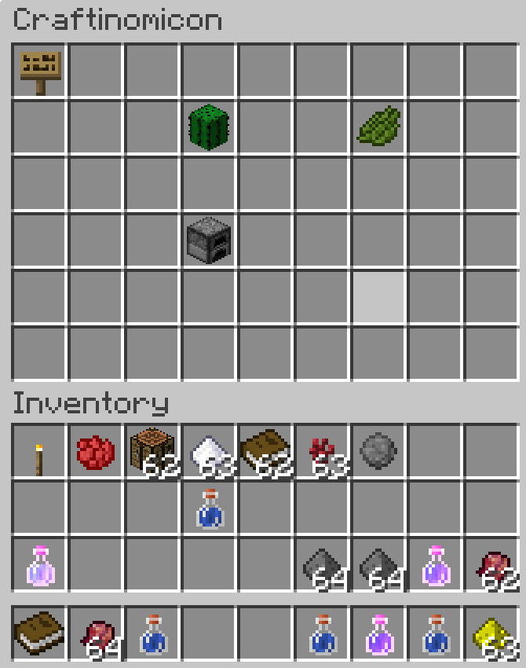
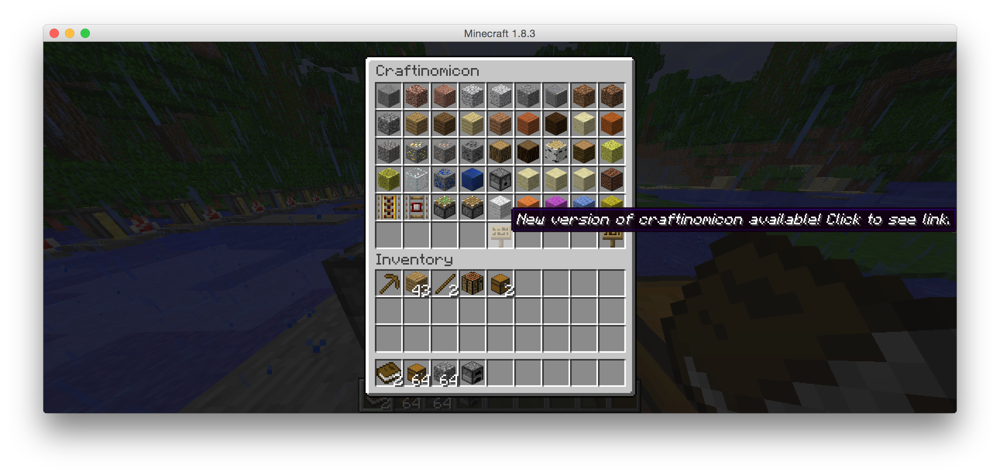

Craftinomicon
=============

Craftinomicon is a [bukkit](https://bukkit.org/) plugin. It adds a new item to the game of minecraft, the craftinomicon,
which is a cheat sheet for all crafting recipes in the game of minecraft. It is directly inspired by
[NEI](http://www.minecraftforum.net/forums/mapping-and-modding/minecraft-mods/1279956-chickenbones-mods),
but as a bukkit plugin, it works with vanilla clients.

[Download craftinomicon](https://github.com/sciolizer/craftinomicon/releases/download/v000.002.002.4194305/craftinomicon-0.2.3.1076363268.jar)

[Bukkit page](http://dev.bukkit.org/bukkit-plugins/craftinomicon/)

Usage
-----

Craft a book and crafting table together to create the craftinomicon.



Right click while selecting the craftinomicon
in your hot bar, and the craftinomicon interface will appear.



Click the signs in the lower corners to page forward and backward. Left click an item to see all of its recipes.
For example, left click the piston to see the recipe for making a piston:



Click the sign in the upper left corner to go back to the previous screen. You can also click one of the items
in the recipe, to "dig down further". For instance, if you click on one of the planks used to make the piston, you
will see the recipe for making planks. Similarly, you can click on any item in your inventory to see its recipe.

Right click any item to see which recipes it is used in. For instance, bone meal:



At the bottom are the different items that can be crafted from bone meal.

Furnace recipes are also supported.



Recipes can be searched by running `/craftinomicon <name>` or `/cr <name>`.
For example, `/cr sword`
will show all of the sword recipes. By default, the search will only succeed if the player
is holding a craftinomicon in their inventory, but this behavior can be changed with the
`craftinomicon.command.bookless` permission. Currently, search only works in English.

Running `/cr` without any args is equivalent to opening the craftinomicon.

The craftinomicon uses the bukkit api to query for all known recipes, so in theory the craftinomicon
should be able to display recipes
from other plugins. This has been tested with
[ReverseCraft](http://dev.bukkit.org/bukkit-plugins/reversecraft/).
If recipes from another plugin are not
appearing in the craftinomicon, please
[file an issue](https://github.com/sciolizer/craftinomicon/issues/new) and I'll see what I can do.

Craftinomicon should work with minecraft 1.7.10 and all later versions. Most testing is done against 1.8.8.

Supported languages
-------------------

Language can be changed from English by changing the language.code property in `$BUKKIT/plugins/craftinomicon/config.yml`.
Currently supported languages are Brazilian Portuguese, English, German, Russian, Simplified Chinese, and Traditional Chinese.
Add your own translation to the [localization page](http://dev.bukkit.org/bukkit-plugins/craftinomicon/localization/)! If the pluralization is confusing, see my [guide to pluralization](https://github.com/sciolizer/craftinomicon/wiki/Localization).

Permissions
-----------

* `craftinomicon.craft.book` Grants the ability to craft the craftinomicon. Default value: true
* `craftinomicon.upgrade.announce` When a new version of craftinomicon is released, users with this permission enabled will see an extra item in their craftinomicon, letting them know that an upgrade is available. If no user has this permission, then the plugin will not attempt to check for updates. Default value: op
* `craftinomicon.command.enabled` Grants the ability to open and search the craftinomicon with the /craftinomicon command, assuming the player already has the book, or the bookless permission is enabled for that player. Default value: true
* `craftinomicon.command.bookless` Grants the ability to open and search the craftinomicon even if the player does not have a craftinomicon in their inventory. If craftinomicon.command.enabled is false, then this permission is ignored. Default value: op

Updates
-------

By default, craftinomicon will check for updates every 24 hours. Nothing is downloaded, but ops will
be able to see an extra item in their craftinomicon, letting them know that a new version is available.



Checking for updates can be disabled by setting the `craftinomicon.upgrade.announce` permission to `false` for all users.

Statistics
----------

By default, craftinomicon sends the following anonymous statistics to [mcstats.org](http://mcstats.org/plugin/craftinomicon):

* Exceptions (programming errors) thrown during execution.
* Whether the update checker is enabled or not.
* Version of the craftinomicon plugin.
* Which language the plugin is configured with.

Collecting this information is helpful to me (sciolizer) for knowing which features to focus on.

Additionally, mcstats collects the following anonymous statistics:

* Number of players
* The server's GeoIP
* Version of minecraft
* Version of bukkit/spigot

Statistics visible to me are visible to everyone. You can read more about
[mcstats on their website](http://mcstats.org/learn-more/).

If you do not want craftinomicon to collect stats from your server, change the `opt-out` value in
`$BUKKIT/plugins/PluginMetrics/config.yml` to true.

Building and installing
-----------------------

```
mvn clean package
cp target/*.jar ~/server/plugins
```
