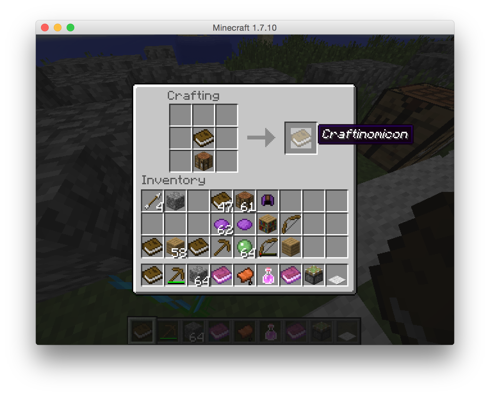

Craftinomicon
=============

Craftinomicon is a [bukkit](https://bukkit.org/) plugin. It adds a new item to the game of minecraft, the craftinomicon,
which is a cheat sheet for all crafting recipes in the game of minecraft. It is inspired by
[NEI](http://www.minecraftforum.net/forums/mapping-and-modding/minecraft-mods/1279956-chickenbones-mods),
but it works with vanilla clients.

Craft a book and crafting table together to create the craftinomicon.



Right click while selecting the craftinomicon
in your hot bar, and the craftinomicon interface will appear.


Click the signs in the lower corners to page forward and backward. Left click an item to see all of its recipes.
For example, left click the piston to see the recipe for making a piston:


Click the sign in the upper left corner to go back to the previous screen. You can also click one of the items
in the recipe, to "dig down further". For instance, if you click on one of the planks used to make the piston, you
will see the recipe for making planks. Similarly, you can click on any item in your inventory to see its recipe.

Right click any item to see which recipes it is used in. For instance, bone meal:


The numbers at the bottom indicate that bone meal is used in 2 shaped recipes, 8 shapeless recipes, and that we are
currently looking at the 5th shapeless recipe. Click the left crafting table to jump to the first shaped recipe,
or the right crafting table to jump to the first shapeless recipe.

Furnace recipes are also supported.


The craftinomicon uses the bukkit api to query for all known recipes, so in theory the craftinomicon
should be able to display recipes
from other plugins. This has not been tested, however.

Craftinomicon was developed against the bukkit api for minecraft 1.7.10.

Building and installing
-----------------------

```
mvn clean package
cp target/*.jar ~/CraftBukkit/plugins
```
